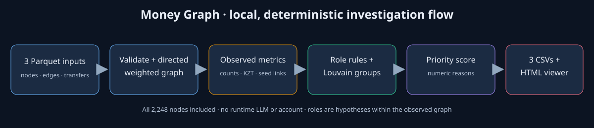

# Money Graph — «Кто выше?»

HackAlem AI 2026 · Finance track · solo project.

An AML analyst starts with 81 known seed clients and an outgoing-only, four-hop
transfer sample. Money Graph produces a ranked investigation queue, numeric
role evidence for every observed client, cluster summaries, and a searchable
directed network view. Roles are **hypotheses for review**, not findings of guilt.

## Run from this repository

Python 3.10 or newer is required. The official organizer input files are in
`data/` in this repository for hackathon judging only.

```bash
python3 -m venv .venv
. .venv/bin/activate
python3 -m pip install -r requirements.txt
python3 run.py --data data --out results
```

The last line is the one-command pipeline: it reads all three raw Parquet
files, checks their consistency, and writes:

| File | Result |
|---|---|
| `results/nodes_roles.csv` | 2,248 gids with role, 0–1 rule strength, cluster, 0–1 priority, and numeric evidence |
| `results/clusters.csv` | 91 clusters with size, seed count, internal observed KZT, top gids, and hypothesis |
| `results/top_nodes.csv` | 30 ranked gids with numeric reasons |
| `results/viewer.html` | Self-contained searchable local viewer |

Open `results/viewer.html` in a browser; it needs no server, account, network,
API key, or LLM. Search an exact `gid`, or click a top-list entry. The map shows
one-hop incoming and outgoing links with arrows, role colors, cluster context,
and clickable neighbors. Gids are encoded as **strings** in the viewer because
the 18-digit IDs exceed JavaScript's safe integer range.

For a judge walkthrough: run the command, open the viewer, inspect the top
candidate, then search any requested `gid`. The evidence text, metrics, incoming
and outgoing links, and visibility caveats are shown together. To check the
output contract and repeatability:

```bash
python3 -m unittest discover -s tests -v
```

On the provided dataset the pipeline completed in about **0.22 seconds** on
the development laptop, below the five-minute limit. Observed role counts:
5 coordinator, 39 consolidator, 61 distributor, 38 transit, 306 terminal,
1,799 peripheral. Every role and priority number is a deterministic heuristic,
not a trained or calibrated probability.

## How decisions are made

All criteria use only observed graph attributes. Rules run in the order below;
the first match becomes the primary role. Full formulas and rationale are in
[the methodology](METHODOLOGY.md), with named thresholds in `run.py`.

| Role | Required observed evidence |
|---|---|
| coordinator | Non-seed; at least 2 direct seed payers, 3 total payers, and 2 recipients |
| distributor | At least 10 recipients; for non-seeds, also at least twice as many recipients as observed payers |
| consolidator | Non-seed below depth 4; at least 3 payers and 500,000 KZT in, with at most 20% observed onward |
| transit | Non-seed; observed in and out, at least 50,000 KZT in, outgoing/incoming ratio 0.80–1.20 |
| terminal | Non-seed at depth 1–3; at least 100,000 KZT in and no qualifying observed outflow |
| peripheral | No stronger rule, or insufficient outgoing visibility at depth 4 |

`role_score` measures how strongly the node meets its rule. It is **not** a
probability that the role is true. The word *terminal* means only that no
qualifying outflow was observed within the sampled network; it never proves
funds stayed there. Depth-four no-outflow nodes are `peripheral` with an
explicit boundary caveat.

Clusters use NetworkX Louvain with seed 42 on an undirected projection weighted
by observed KZT. Reciprocal transfers are summed before clustering. Direction
is retained for roles, ranking evidence, and the viewer. All 19 isolated seeds
become singleton clusters. Sorting by `gid` and canonical cluster IDs make
repeated outputs byte-identical in the checked environment.

Priority combines normalized observed in+out activity (30%), maximum
counterparty degree (20%), direct seed payers (20%), role strength (20%), and
cluster seed count (10%). Known seeds receive a ×0.50 factor because they are
already in the analyst's starting list. Depth-four no-outflow nodes receive a
×0.60 factor for limited visibility. `top_nodes.csv` gives concrete counts and
the two largest score contributions for each rank. These weights guide review;
they are not calibrated risk probabilities.

## Input and limits

The organizer package contains 2,248 nodes, 3,119 directed aggregated edges,
and 4,840 transactions from July 2026. Collection starts at 81 seeds and
follows **outgoing** transfers for four hops, within one bank, for transfers
of at least 5,000 KZT. No names, demographics, balances, or external sources
are used. The three Parquet files under `data/` are restricted to hackathon use.

The graph is incomplete by design: seed inflows and other outside-sample
inflows are missing, and transfers beyond depth four are unobserved. Therefore
observed in/out amounts are not account balances, a near-one ratio does not
prove that the same money was forwarded, and a missing outflow does not prove
money settled. Transactions below 5,000 KZT, other banks, and other dates are
outside the sample. There are no verified role labels against which to measure
accuracy.

The input graph has 35 weak components **when all 19 isolated seeds are
included**; the organizer's stated 16 counts only edge-containing components.
Louvain discards flow direction for grouping and may produce different
communities under a different NetworkX version. The pinned minimum dependency
versions are in `requirements.txt`; use the checked environment for exact CSV
comparison.

## Architecture and scaling



`run.py` loads and reconciles data, builds a directed weighted NetworkX graph,
calculates observed features, applies transparent role rules, clusters an
undirected projection, calculates priority, then writes CSVs and a standalone
HTML view. The viewer embeds precomputed facts and does not modify results.

At about one million nodes, replace NetworkX with a faster graph engine and
columnar feature calculations, approximate expensive community/centrality
work, store precomputed clusters and ego neighborhoods, and render only a
searched neighborhood rather than the whole graph. The explainable batch role
rules can remain, but their thresholds would need re-profiling on new data.

See [disclosure](DISCLOSURE.md) for organizer materials and AI development
assistance. No runtime LLM, paid service, or personal account is required.
